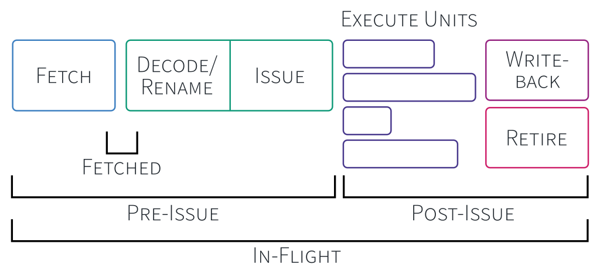
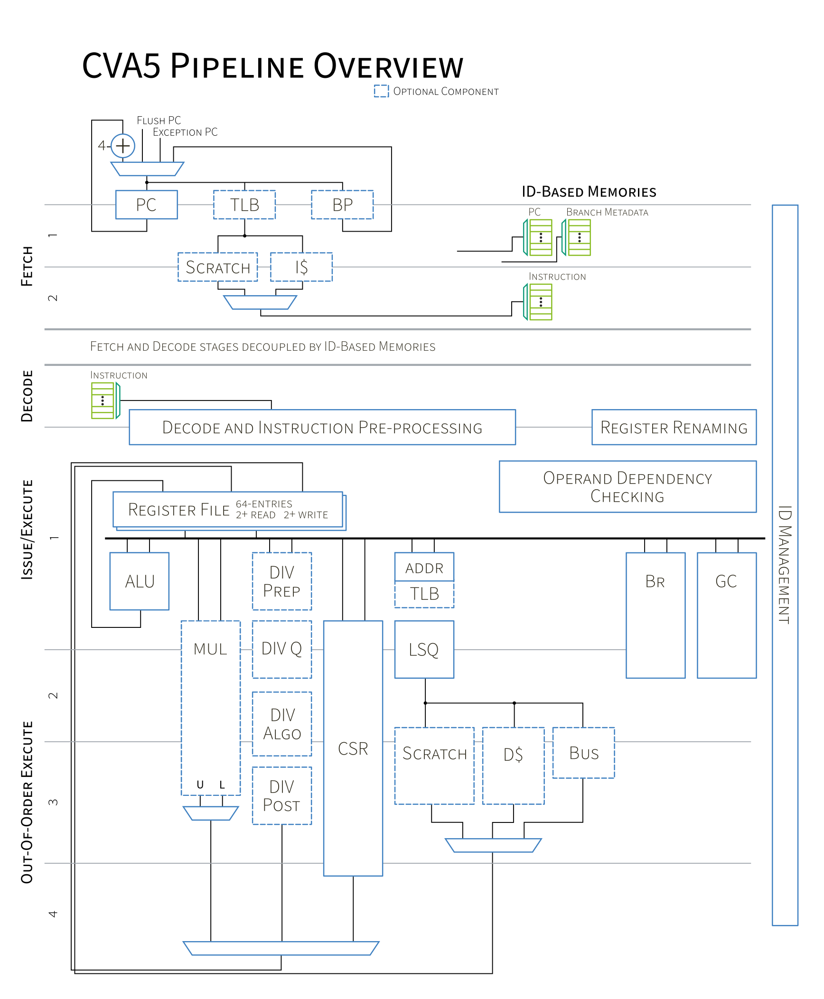

# Overview

The CVA5 is a highly-configurable processor designed for modern SRAM-based FPGAs. A key feature is that it heavily leverages LUT-based memories to provide decoupling between pipeline stages.  The figure below shows the different logical stages of the pipeline. Each colour represents a stage that moves, or can move, independently with respect to the other pipeline stages.



The brackets in the diagram represent how instructions are tracked.  Instructions in the front-end of the processor are considered pre-issue (and are flushed on a branch flush, exception etc).  Instructions post-issue will always continue to the retire stage, even if an exception occurs.  At the retire stage they will be handled such that they do not affect the architectural state.

This decoupling of the pipeline stages helps support two key performance features of the processor:
 - Variable latency execution
 - Out-of-order completion of instructions

Once an instruction has been issued, the order in which it completes, and how many cycles it takes are automatically handled by the ID-tracking system (and renaming for the register-file).

The following figure provides a more detailed breakdown of the structure of the various pipeline stages:


## ID-based tracking
Each instruction is associated with a unique ID whilst it is in-flight.  IDs are assigned sequentially wrapping around when the MAX_IDS limit is reached. The limit on in-flight instructions is part of the global processor config file (cva_config.sv) and can be set up to 32 IDs.  In practice, 8-16 IDs is sufficient for the current latencies within the processor.  Higher ID limits just increase the amount of fetched instructions that have not yet been decoded/issued.  This can sometimes decrease performance as the Return Address Stack (RAS) is updated speculatively, thus, the longer the prefetch window the more likely there is to be a mis-speculation.

## Store Queue and forwarding support
Due to the out-of-order completion support, a store queue is required for throughput reasons, to buffer stores until they retire.  CVA5 features a scalable design with mostly fixed overhead, with support for load bypassing.  Additionally, the store queue supports receiving stores without their corresponding data.  The store queue snoops the writeback stage and can forward the data as needed to the stores in the store buffer.

### Forwarding benefits for custom units
The main benefit of data forwarding to stores is that it can help prevent stalls due to long latency instructions whose results are immediately written to memory.

Without data forwarding, the follow sequence would stall on each store-word instruction.
```
long-latency-accel r2, r5, r3
sw r6, r2
long-latency-accel r2, r6, r3
sw r6, r2
```
With data forwarding the main constraints are the latency of the accelerator and the max IDs supported.  As long as the number of instructions in-flight is less than the max IDs supported, there will be no stalls.

## Register-File
The register-file of CVA5 is a multi-banked renamed register-file with 64 physical entries and support for a configurable number of writes and reads per cycle.  The number of writes is determined by the number of writeback ports, and the number of reads, by the number of RS ports.

By default, 2 read ports are provided, however it is just a config file change to add more ports.  The only additional requirement being providing the address bits for additional ports.

## Writeback support
CVA5 supports multiple, independent, writeback ports to the register-file (Three by default as shown in the cycle-breakdown figure from earlier).  By default, one is reserved for the ALU as it has tight timing requirements, and it is the unit most likely to overlap its completion with other execution units (due to its single-cycle latency and typical instruction mixes).  The Load/Store unit also has its own dedicated port, primarily for clock frequency considerations when including the data cache.

The remainder of the execution units, (CSRs, Mul and Div), share a third writeback port.  Arbitration is performed with a fixed priority for a writeback port, with the highest priority assigned to the first unit connected.  Thus, the first unit will always have its result accepted if it has completed an instruction.  This can be leveraged to help support any unit with complex control signals.  The fixed priority will not create any deadlock situation as limits on IDs in-flight provides a small upper limit on how long an instruction result can be blocked.

## Retire support
Finally, after an instruction is ready to complete (has already written to the register-file, is ready to write to memory, or has simply become the oldest in-flight instruction), an instruction can be retired.  For instructions that write to the register-file, this means that the register mapping is committed, and the old index for the physical rd-address is made available.  For stores, it means they are lazily released to memory.  Instructions such as branches have no affect, (unless they have triggered an exception).

In any given cycle, up to two instructions can be retired (by default) with the following constraints:
 - Only one of them can have written to the register-file
 - Only one of them can be a store

The number of retire ports is configurable, but by supporting at least two ports, the retire stage can catch up to bursts of completed instructions.

# Coding Structure
When navigating the source, there are several key files with definitions used throughout the processor:

 - `riscv_types.sv`, for typedefs and constants relating to the RISCV-ISA
 - `cva5_types.sv` for typedefs and constants specific to CVA5
 - `internal_interfaces.sv` defines all SystemVerilog interfaces used within the processor that have no external connections
 - `external_interfaces.sv` defines all SystemVerilog interfaces used to interface with components outside of the processor core (ie. bus interfaces)
 - `cva5_config.sv` contains the definition of the top-level parameter struct for the processor along with a few constants, such as the max in-flight IDs (MAX_IDS) that are set here.

 For the most part, unit support is split between three files: the unit itself, the toplevel cva5.sv (which instantiates the unit), and cva5_config.sv to provide parameterization support.